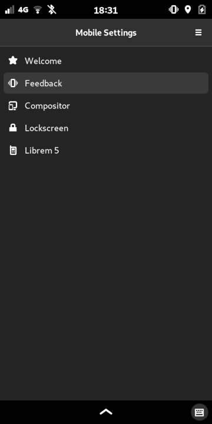
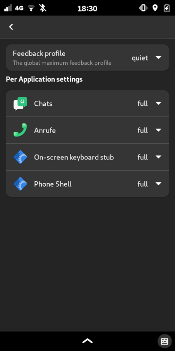
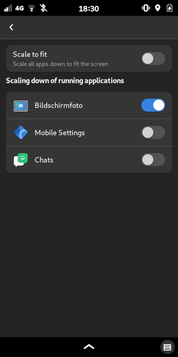

# Phosh Mobile Settings

Mobile Settings App for [phosh](https://gitlab.gnome.org/World/Phosh/phosh) and
related components.

## License

Phosh Mobile Settings is licensed under the GPLv3+.

## Getting the source

```sh
git clone https://gitlab.gnome.org/guidog/phosh-mobile-settings
cd phosh-mobile-settings
```

The [main][] branch has the current development version.

## Dependencies
On a Debian based system run

```sh
sudo apt-get -y install build-essential
sudo apt-get -y build-dep .
```

For an explicit list of dependencies check the `Build-Depends` entry in the
[debian/control][] file.

## Building

We use the meson (and thereby Ninja) build system for phosh.  The quickest
way to get going is to do the following:

```sh
meson . _build
ninja -C _build
```

## Running

You can run form the source tree:

```sh
_build/src/phosh-mobile-settings
```
The result should look something like this:





# Getting in Touch
* Issue tracker: https://gitlab.gnome.org/guidog/phosh-mobile-settings/issues
* Matrix: https://im.puri.sm/#/room/#phosh:talk.puri.sm

[main]: https://gitlab.gnome.org/World/guido/phosh-mobile-seettings/-/tree/main
[.gitlab-ci.yml]: https://gitlab.gnome.org/World/guido/phosh-mobile-settings/-/blob/main/.gitlab-ci.yml
[debian/control]: https://gitlab.gnome.org/World/guido/phosh-mobile-settings/-/blob/main/debian/control
